# Crop for Trust: Reliability-Aware Industrial Image Classification

[](LICENSE)
[](https://www.python.org/)
[](https://pytorch.org/)
[](https://hub.docker.com/r/kyeonghah/crop-for-trust)
[](https://huggingface.co/spaces/kyeonghah/crop-for-trust)

> **Crop for Trust: Reliability-Aware Industrial Image Classification via ROI Focusing and Generative Annotation Cleaning**
>
> This repository contains the **official open-source implementation** of the paper *"Crop for Trust: Reliability-Aware Industrial Image Classification via ROI Focusing and Generative Annotation Cleaning"*.
>
> **Author:** Kyeongha Hwang (Suwon University, Korea)

---

## 1. Project Overview

This research introduces a **Two-Branch Debiasing Framework** designed to enhance **Intrinsic Data Reliability (IDR)** in industrial image classification. In industrial datasets, visual artifacts (e.g., human markings, surrounding noise) often introduce bias, leading to model unreliability. Our framework mitigates this via:

1.  **Generative Annotation Cleaning (GAC):** A restoration module that removes visual biases (human annotations) using Generative AI inpainting.
2.  **YOLO-based ROI Cropping (YOLO-Crop):** An attention-focusing module that isolates the damage area, eliminating background noise.

---

## 2. Reproducibility

We provide two levels of reproduction to ensure the reliability and transparency of our experiments.

### Option A: Interactive Online Demo (Fast Verification)
For quick verification of the pipeline without installation, access our hosted demo on Hugging Face Spaces. This demonstrates the full flow (Cleaning $\rightarrow$ Cropping $\rightarrow$ Classification) on sample data.

[](https://huggingface.co/spaces/kyeonghah/crop-for-trust)

### Option B: Docker Environment (Full Experiment)
For full reproducibility, including the ability to switch YOLO backbones (v2, v4, v5, v8) reproduce the exact experimental environment, we provide a pre-built Docker image.

**Prerequisites:**
* Docker installed on your local machine.
* Google Gemini API Key (required for the GAC module).

**Quick Start:**
Execute the following command in your terminal. This will download the image and run the pipeline verification immediately.

```bash
# Replace "YOUR_GEMINI_API_KEY" with your actual Google Gemini API key
docker run -it --rm \
  -e GEMINI_API_KEY="YOUR_GEMINI_API_KEY" \
  kyeonghah/crop-for-trust:latest
```
Inside the Docker Container: The container includes the full source code, fine-tuned weights, and the sample dataset. Upon execution, it performs the following pipeline steps automatically:
1. Annotation Cleaning: Removes artifacts from data/sample/original.
2. YOLO Cropping: Detects defects using Fine-tuned YOLOv8s.
3. Data Augmentation: Splits and balances the dataset.
4. Classification: Trains MobileNetV2 (1 Epoch) and reports Accuracy/F1-Score.

## 3. Usage
The project is orchestrated by src/main.py. The framework supports various configurations for ablation studies.

### Basic Command

```bash
python src/main.py
```

### CLI Options

| Option        | Description   |
| ------------- | ------------- |
| --config      | Path to the configuration file (Default: utils/config.yaml). |
| --[no_]annot_clean  | Enable or disable the Generative Annotation Cleaning (GAC) module. |
| --[no_]yolo_crop  | Enable or disable YOLO-based ROI Cropping.  |
| --annot_clean_test_mode  | Run GAC in test mode (evaluation-only) to save API costs. |
| --yolo_model  | Specify YOLO Backbone. (e.g., yolov2, yolov4, yolov5, yolov8{s, m, l, x}.)  |

### Execution Examples

1. Reproduce the Hybrid Method (Ours, Default)

```bash
python src/main.py --annot_clean --yolo_crop --yolo_model yolov5
```

2. Experiment with Different Backbones To verify the robustness of ROI cropping, you can switch the detection model:

```bash
python src/main.py --no_annot_clean --yolo_crop --yolo_model yolov8x
```

3. Run Baseline (No Cleaning, No Cropping)

```bash
python src/main.py --no_annot_clean --no_yolo_crop
```
---

## 4. Experimental Results

We evaluated the proposed framework's effectiveness through qualitative and quantitative analysis.

---

### Qualitative Analysis: Pipeline Transformation
The visual comparison below demonstrates the efficacy of each module.
- (b) YOLO-Crop: Removes background noise but retains human markings.
- (c) GAC: Removes human markings but retains background noise.
- (d) Hybrid (Ours): Achieves both noise reduction and artifact removal.


| Category | (a) Original | (b) YOLO-Crop | (c) GAC | (d) Hybrid |
|:---------:|:---------:|:--------------:|:------------:|:----------------:|
| **Repair** |  | 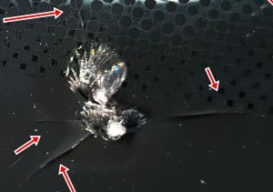 |  | 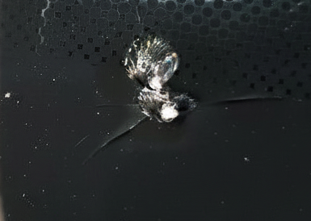 |
|            |  | 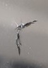 |  |  |
|           |  |  |  |  |
| **Replace** |  |  | 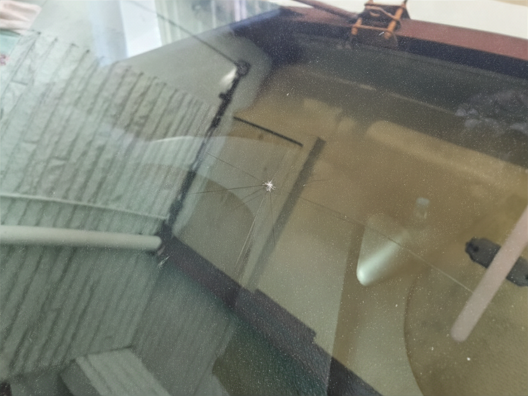 |  |
|           |   |  |  |  |
|           |  | 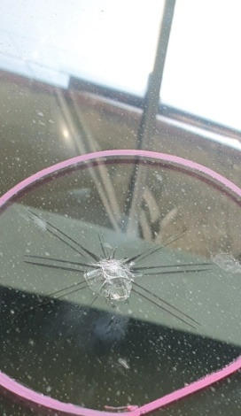 |  | 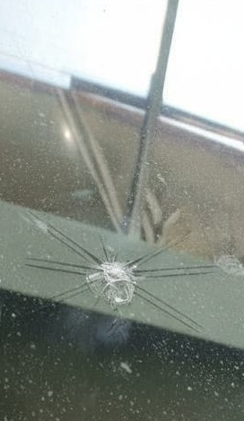 |

---

### Grad-CAM Visualization

We analyzed the model's focus using Grad-CAM. The results indicate that our method shifts the model's attention from irrelevant background features or annotations to the actual damage regions.

1. Original Dataset

| (a) Raw Input | (b) Baseline | (c) Ours(YOLO-Crop) |
|---------------|---------------|---------------|
| 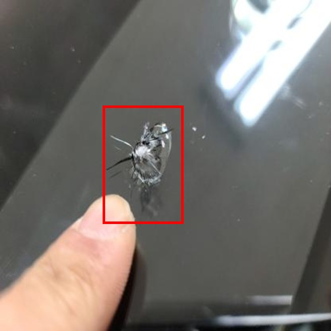 | 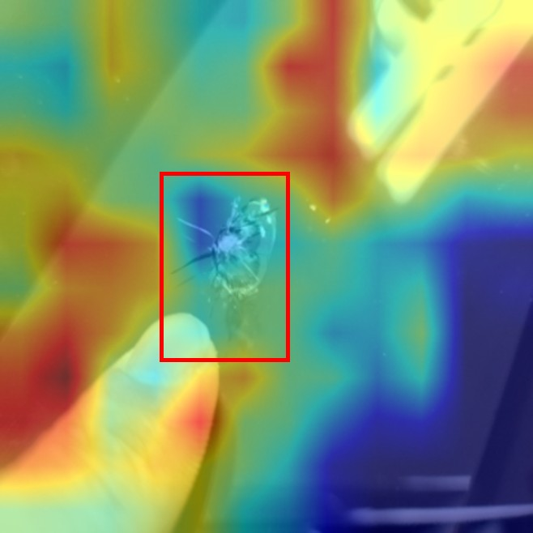 | 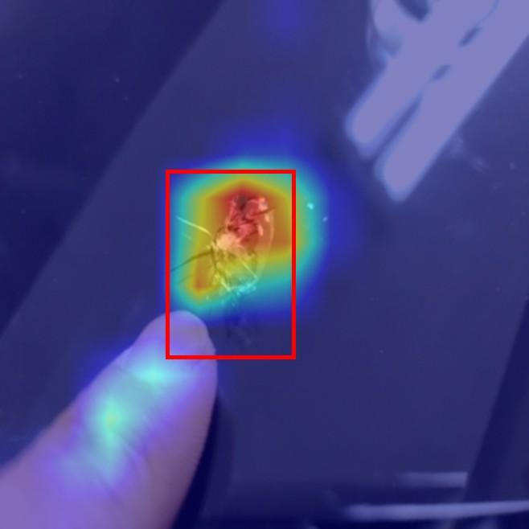 | 
| 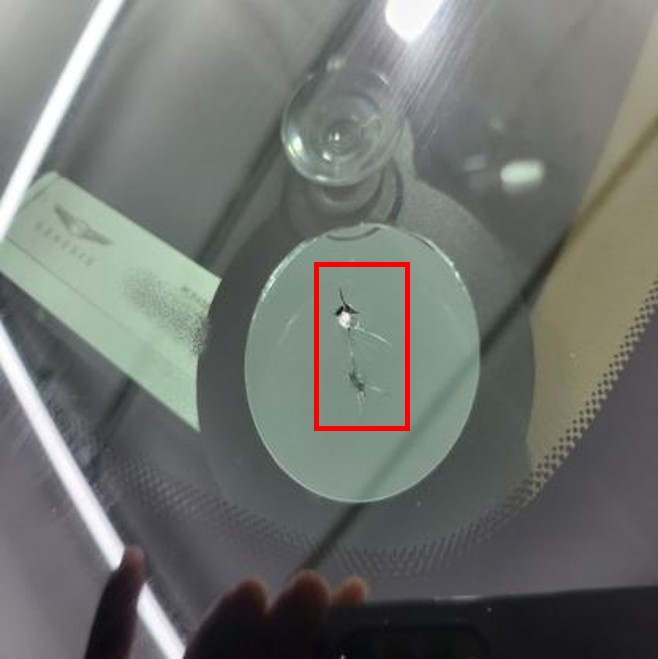 | 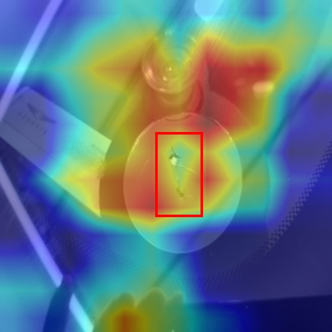 | 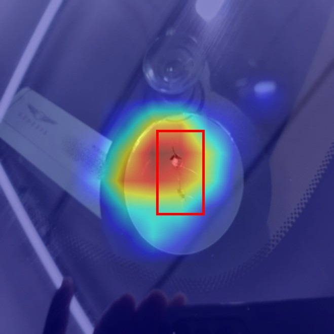 | 


2. GAC Dataset

| (a) Raw Input | (b) Baseline | (c) Ours(YOLO-Crop) |
|---------------|---------------|---------------|
| 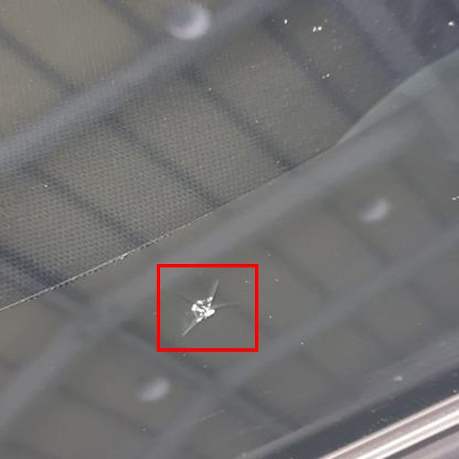 | 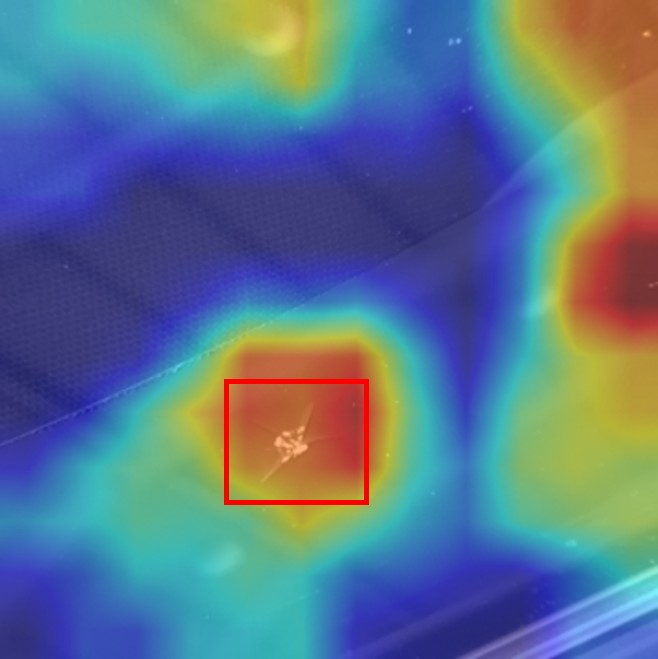 | 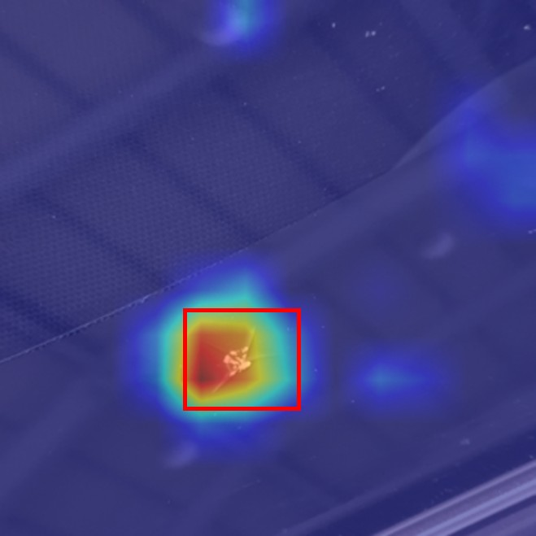 | 
| 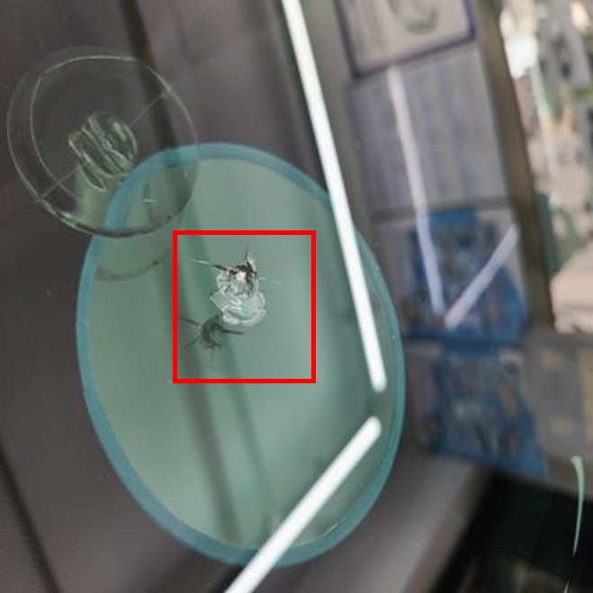 | 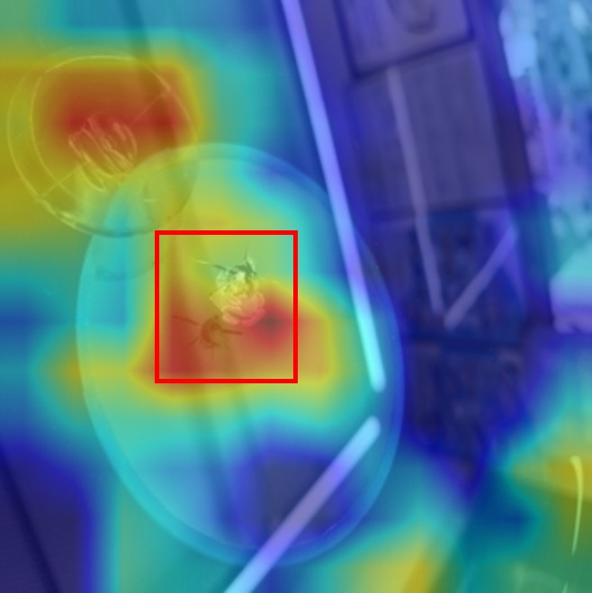 | 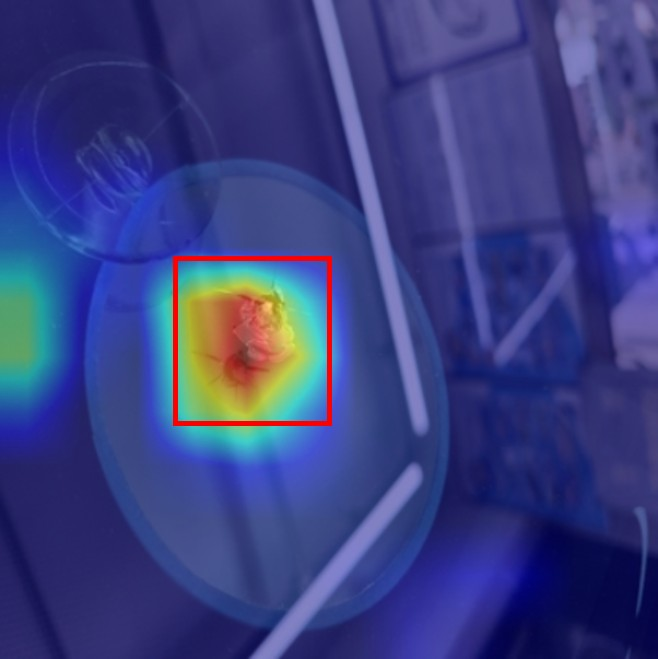 | 


> *Observation:*  
> The YOLO-Crop methodology consistently compels the classifier to focus on the intrinsic features of the defect, regardless of whether the dataset contains annotations or generative artifacts.

---

### Quantitative Analysis

Data Reliability is defined as $1 - \text{Bias Ratio}$ (e.g., proportion of images with visual artifacts).

| Condition | Data Reliability | Annotation Clean | YOLO Crop | Best Acc (%) |
|------------|------------------|------------------|------------|---------------|
| (a) Original | 66% | ✗ | ✗ | **95.39** |
| (b) YOLO-Crop | 89.80% | ✗ | ✓ | **97.46** |
| (c) GAC | 100% | ✓ | ✗ | **88.94** |
| (d) Hybrid | 100% | ✓ | ✓ | **93.40** |

> *Key Observation:*  
> 1. Impact of Cropping: Removing contextless background via YOLO Cropping (b) yields the highest accuracy (97.46%).
> 2. Reliability vs. Accuracy Trade-off: While GAC (c) achieves 100% reliability by removing all bias, it suffers an accuracy drop due to generative artifacts.
> 3. Optimal Balance: The Hybrid method (d) recovers significant accuracy (93.40%) while maintaining 100% data reliability, demonstrating the most robust performance for trustworthy industrial AI.

---

## 5. Citation

If you find this work useful for your research, please cite our paper:

```bash
@article{hwang2025cropfortrust,
  title={Crop for Trust: Reliability-Aware Industrial Image Classification via ROI Focusing and Generative Annotation Cleaning},
  author={Kyeongha Hwang},
  journal={Journal Name (Under Review)},
  year={2025}
}
```