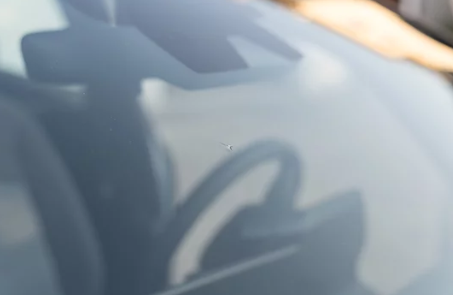
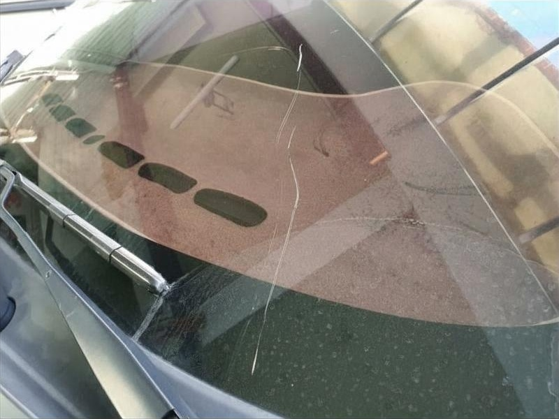
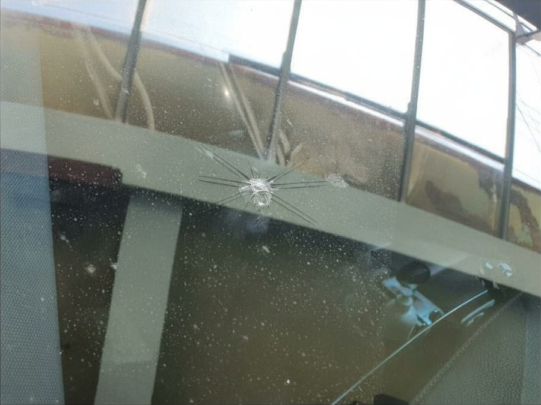

# Crop for Trust: Reliability-Aware Industrial Image Classification

[](https://www.python.org/)
[](https://pytorch.org/)
[](LICENSE)

> **Crop for Trust: Reliability-Aware Industrial Image Classification via ROI Focusing and Generative Annotation Cleaning** > This repository provides the **official open-source implementation** of the paper *"Crop for Trust: Reliability-Aware Industrial Image Classification via ROI Focusing and Generative Annotation Cleaning"*.  
> The study was conducted by **Kyeongha Hwang (Suwon University, Korea)**.

---

## Project Overview

This project introduces a **Two-Branch Debiasing Framework** aimed at enhancing **Intrinsic Data Reliability (IDR)** in industrial scenarios. The framework consists of:
1.  **Generative Annotation Cleaning (GAC):** Removes visual biases (human markings) using Generative AI.
2.  **YOLO-based ROI Cropping (YOLO-Crop):** Focuses the model's attention solely on the damage area.

---

## Reproduction Guide

This section describes how to reproduce and execute the proposed framework.

### Environment Setup

Run the following command to automatically create the environment and install all dependencies:

```bash
bash setup.sh
```

This script will:

- Create a new Conda environment (tf_env)

- Install dependencies from requirements.txt

- Clone external repositories (Darknet, YOLOv5) into third_party/

- Download pretrained weights (YOLOv2/v4) and fine-tuned YOLOv8s weights

- Download fine-tuned YOLOv8s weights from Google Drive (these are custom-trained weights used in the project for reproducible evaluation)

- After setup, activate the environment using:

```bash
conda activate tf_env
```

#### Gemini API Key Configuration

> The Annotation Cleaning module utilizes the Google Gemini API for generative inpainting. Set your API key before running the pipeline:

```bash
export GEMINI_API_KEY="your_api_key_here"
```
(The utils/config.yaml automatically loads this key.)

### Run the Main Pipeline

Execute the unified dual-pipeline using:

```bash
python src/main.py
```

This command launches the Crop-for-Trust pipeline, consisting of:

1. Generative Annotation Cleaning(GAC): Removes human-drawn marks via generative inpainting.

2. YOLO-based ROI Cropping(YOLO-Crop): Detects and crops damage regions (YOLO v2, v4, v5, v8).

3. Data Augmentation: Balances the dataset using class-aware augmentation.

4. Classification & Evaluation: Trains CNN classifiers and measures performance.

#### CLI Options

| Option        | Description   |
| ------------- | ------------- |
| --annot_clean [on/off]  | Performs annotation cleaning to remove human markings. |
| --test [on/off]  | Runs in test mode (default: 3 images) to save API costs.  |
| --yolo_crop [on/off]  | Enables ROI cropping using a fine-tuned YOLO model. |
| --yolo_model [model_name]  | Specifies the YOLO model (e.g., yolov2, yolov4, yolov5, yolov8s).  |

### Example Usage

```bash
# Run annotation cleaning only
python src/main.py --annot_clean on --yolo_crop off

# Run YOLO-based cropping only
python src/main.py --annot_clean off --yolo_crop on --yolo_model yolov8m

# Test mode (process only 3 images)
python src/main.py --annot_clean on --test on
```

### Configuration

All module settings are managed via utils/config.yaml.

> **Note on Custom Data:** To test on your own images, place them in:
> data/sample/annotation_cleaner/only_annotation_image/
> Then run with --annot_clean on.

---

## Example Results (Sample Dataset)

The table below visualizes the transformation of data through the pipeline.

(b) YOLO-Crop: Focuses on damage, removing background noise.
(c) GAC: Removes human annotations but preserves the original field of view.
(d) Hybrid: The proposed method; clean background + focused ROI.


| Category | (a) Original | (b) YOLO-Crop | (c) GAC | (d) Hybrid |
|:---------:|:---------:|:--------------:|:------------:|:----------------:|
| **Repair** |  |  |  |  |
|            |  |  |  |  |
|           |  |  |  |  |
| **Replace** |  |  |  |  |
|           |   |  |  |  |
|           |  |  |  |  |


---

## Experimental Results

We evaluated the classification performance on four dataset configurations.

---

### Grad-CAM Visualization

Grad-CAM results show that YOLO-based cropping (b, d) significantly improves model attention, shifting focus from irrelevant background/markings to the actual damage

| (a) Original | (b) YOLO-Crop | (c) GAC | (d) Hybrid |
|---------------|---------------|---------------|----------------|
|  |  |  |  |
|  |  |  |  |

> *Observation:*  
> When the model trained on the YOLO Cropped dataset was used to infer the original images,
it exhibited much stronger attention around the actual damage regions. 
> This phenomenon was consistently observed in both the Original and Generatively Cleaned datasets.
> We argue that this improvement arises because YOLO cropping effectively removes contextless, non-damage regions,
allowing the model to focus more precisely on the true damage areas during learning.

---

### Quantitative Analysis

Data Reliability is defined as $1 - \text{Bias Ratio}$ (e.g., proportion of images with human markings).

| Condition | Data Reliability | Annotation Clean | YOLO Crop | Best Acc (%) |
|------------|------------------|------------------|------------|---------------|
| (a) Original | 66% | ✗ | ✗ | **95.39** |
| (b) YOLO-Crop | 89.80% | ✗ | ✓ | **97.46** |
| (c) GAC | 100% | ✓ | ✗ | **88.94** |
| (d) Hybrid | 100% | ✓ | ✓ | **93.40** |

> *Key Observation:*  
> - YOLO Cropping Impact: Applying YOLO cropping consistently improved accuracy by removing contextless regions.
> - Reliability vs. Accuracy: While Generative Cleaning (c) achieved 100% reliability (removing all bias), it caused a drop in 
> accuracy due to generative artifacts. However, combining it with YOLO Cropping (d) recovered accuracy to 93.40%, demonstrating
> that our method effectively balances Trustworthiness and Performance.

---

## Note on Data Privacy

The full dataset is private. A sample dataset is provided in data/sample/ for testing pipeline functionality.

---

## Citation

'''bash
If you use this code for your research, please cite our paper:
@article{hwang2025cropfortrust,
  title={Crop for Trust: Reliability-Aware Industrial Image Classification via ROI Focusing and Generative Annotation Cleaning},
  author={Hwang, Kyeongha},
  journal={Journal Name (TBD)},
  year={2025}
}
'''